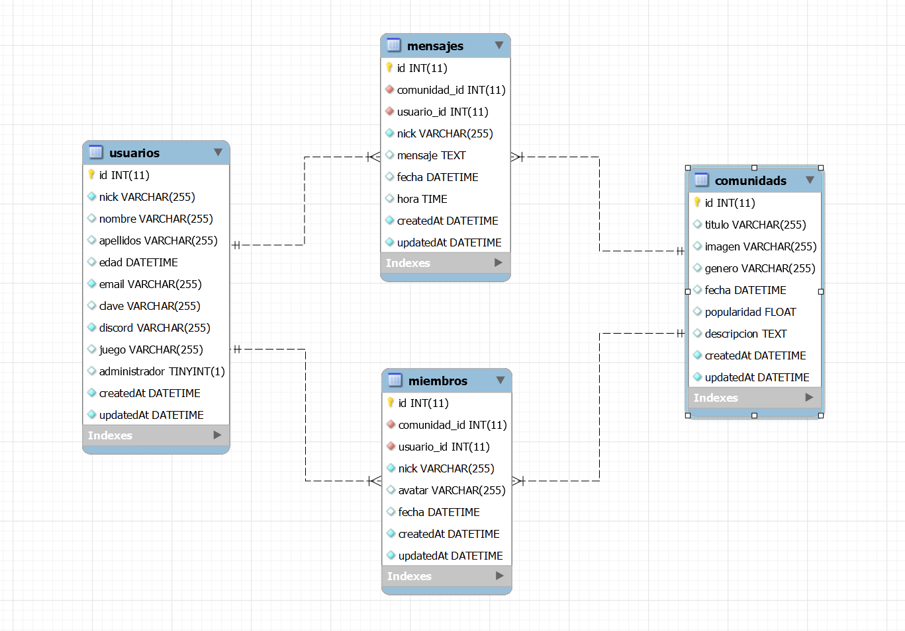

# Proyecto Comunity Games API
***

***
## Proyecto realizado para GeeksHubs Academy como Proyecto Final del curso de Desarrollo de Aplicaciones Web.
El proyecto consta de 4 tablas: comunidades, miembros, usuarios y mensajes. Los usuarios podrán hacerse miembro de distintas comunidades.podrán enviar mensajes a un chat común de cada comunidad independiente y poder contactar con miembros de su misma comunidad para poder jugar juntos. La relación entre tablas és la siguiente:
***

***

## Pre-requisitos del proyecto para hacerlo funcionar en tu equipo local:

* Instalar **Nodejs** en nuestro equipo, descargándolo de su página oficial
https://nodejs.org/

* Clonar el proyecto en nuestro equipo con git:
```
$git clone 'url-del-repositorio'
```

* Instalar todas las dependecias con el siguiente comando:
```
npm install
```

* Arrancamos el servidor con el siguiente comando:
```
npm start
```

## Creación de la base de datos

Tras modificar el archivo /config/config.json con los datos de nuestro servidor mysql (nombre, contraseña, database y host), ejecutaremos los siguientes comandos:
* **Creación de la base de datos**:
```
npx sequelize db:create
```
* **Creación de las tablas**:
```
npx sequelize db:migrate
```
* **Creación de los Seeders**:
```
npx sequelize db:seed:all
```

## ENDPOINTS DE LA API

* ENLACE A LA COLECCION DE POSTMAN, CONFIGURADO CON TODOS LOS ENDPOINTS DE LA API
    * (IMPORTANTE) DENTRO DEL ENLACE CLICKEA ARRIBA A LA DERECHA EN RUN IN POSTMAN PARA IMPORTAR LA COLECCIÓN

    [](https://documenter.getpostman.com/view/19641286/Uyr5oKYK)


## Tecnologías utilizadas en el proyecto:

* **express**: Instalamos express en nuestro proyecto:
```
npm install express
```
* **nodemon**: Instalamos nodemon en nuestro proyecto. También añadimos en nuestro **package.json** un script para poder ejecutarlo:
```
npm install nodemon
```
```
//AÑADIDO EN PACKAGE.JSON
"dev": "nodemon index.js"
```
```
//EJECUTAMOS EN TERMINAL
npm run dev
```
* **morgan**: Instalamos morgan en nuestro proyecto, para poder mostrar mensajes por terminal al realizar peticiones al servidor.
```
npm install morgan
```
* **winston**: Instalamos winston en nuestro proyecto, creando la posibilidad de generar logs y guardarlos.
```
npm install wiston
```
* **sequelize**: Instalamos sequelize en nuestro proyecto, haciendo que podamos conectarnos y manipular la base de datos.
```
npm install sequelize-cli -g
npm install --save sequelize mysql2 sequelize-cli
sequelize init
```
* **cors**: Instalamos cors en nuestro proyecto, para tener un control de acceso a nuestra API:
```
npm install cors
```
* **jsonwebtoken**: Instalamos jsonwebtoken en nuestro proyecto para gestionar uso de tokens:
```
npm install jsonwebtoken
```
* **bcrypt**: Instalamos bcrypt en nuestro proyecto para encriptar contraseñas:
```
npm install bcrypt
```

## Explicación de la estructura del proyecto

Usamos el modelo vista-controlador para estructurar el proyecto. **Creamos un CRUD básico**. En el proyecto existirá la siguiente estructura:

* **index.js**: Este es el archivo principal. En este archivo se llama al archivo de las rutas, en donde se gestiona la ruta inicial (/) y se arranca el servidor.

* **config**
    * **config.json**: En este archivo se gestiona la configuración para conectar con la base de datos. Se crea de manera automática con **sequelize**.
    * **auth.js**: En este archivo se gestiona la clave con la que se cifra el password a encriptar, la duración del token y la cantidad de veces que se encripta el password.

* **middlewares**
    * **auth.js**: En este archivo se gestiona la existencia y uso de los token para acceder a las zonas restringidas de la API. De aquí se obtiene el rol del usuario.


* **db.js**: En este archivo se gestiona el acceso a la base de datos.

* **router.js**: En este archivo se gestiona las diferentes vistas que puede tener la aplicación. Se creará una ruta por cada tabla de la base de datos a la que queramos acceder (películas, usuarios y pedidos).

* **views**
    * **ComunidadRouter.js**: En este archivo gestionamos la ruta /comunidades y los endpoints que apuntan a dicha ruta.
    * **MensajeRouter.js**: En este archivo gestionamos la ruta /mensajes y los endpoints que apuntan a dicha ruta.
    * **MiembroRouter.js**: En este archivo gestionamos la ruta /miembros y los endpoints que apuntan a dicha ruta.
    * **UsuarioRouter.js**: En este archivo gestionamos la ruta /usuarios y los endpoints que apuntan a dicha ruta.

* **controllers**
    * **ComunidadController.js**: En este archivo creamos las funciones de cada endpoint:
        * **verComunidades**: Obtenemos un listado de todas las Comunidades.
        * **verComunidadId**: Obtenemos la Comunidad buscada por su número id.
        * **verComunidadGenero**: Obtenemos un listado de las Comunidades filtrado por el género de la Comunidad.
        * **crearComunidad**: Creamos una Comunidad nueva (securizado para que solo pueda acceder un administrador).
        * **modificarComunidadId**: Modificamos una Comunidad existente por su número id (securizado para que solo pueda acceder un administrador).
        * **borrarComunidades**: Eliminamos todas las Comunidades (securizado para que solo pueda acceder un administrador).
        * **borrarComunidadId**: Eliminamos una Comunidad existente por su número id (securizado para que solo pueda acceder un administrador).
    * **MensajeController.js**: En este archivo creamos las funciones de cada endpoint:
        * **verMensajes**: Obtenemos un listado de todos los Mensajes.
        * **verMensajeId**: Obtenemos el Mensaje buscado por su número id.
        * **verMensajesComunidadId**: Obtenemos un listado de los Mensajes filtrado por la Comunidad correspondiente.
        * **crearMensaje**: Creamos un Mensaje nuevo una vez unido a una Comunidad.(indicando el id de la Comunidad y el id de Usuario).
        * **modificarMensajeId**: Modificamos un Mensaje existente por su número id.
        * **borrarMensajeId**: Eliminamos un Mensaje existente por su número id.
        * **borrarMensajes**: Eliminamos todos los Mensajes existentes.(securizado para que solo pueda acceder un administrador)
    * **MiembroController.js**: En este archivo creamos las funciones de cada endpoint:
        * **verMiembros**: Obtenemos un listado de todos los Miembros.(securizado para que solo pueda acceder un administrador)
        * **verMiembroId**: Obtenemos el Miembro buscado por su número id.(securizado para que solo pueda acceder un administrador)
        * **verMiembrosComunidadId**: Obtenemos un listado de los Miembros filtrado por la Comunidad correspondiente.
        * **crearMiembro**: Creamos un Miembro nuevo de una Comunidad.(indicando el id de la Comunidad y el id de Usuario).
        * **modificarMiembroId**: Modificamos un Miembro existente por su número id.
        * **borrarMiembros**: Eliminamos todos los Miembros existentes.(securizado para que solo pueda acceder un administrador)
        * **borrarMiembroId**: Eliminamos un Miembro existente por su número id.
    * **UsuarioController.js**: En este archivo creamos las funciones de cada endpoint:
        * **verUsuarios**: Obtenemos un listado de todos los Usuarios.(securizado para que solo pueda acceder un administrador)
        * **verUsuarioId**: Obtenemos el Usuario buscado por su número id.(securizado para que solo pueda acceder un administrador)
        * **crearUsuario**: Creamos un Usuario nuevo.
        * **login**: Obtenemos un token distinto según si el Usuario es Administrador o no.
        * **modificarUsuarioId**: Modificamos un Usuario existente por su número id.
        * **modificarClaveUsuarioId**: Modificamos la contraseña de un Usuario existente por su número id.
        * **borrarUsuarios**: Eliminamos todos los Usuarios existentes.(securizado para que solo pueda acceder un administrador)
        * **borrarUsuarioId**: Eliminamos un Usuario existente por su número id.

* **migrations**
    * **01-create-usuario.js**: Se genera este archivo al introducir el comando:
    ```
    npx sequelize model:generate --name usuario --attributes nick:string,nombre:string,apellidos:string,edad:date,email:string,clave:string,discord:string,juego:string,administrador:boolean
    ```
    * **02-create-comunidad.js**: Se genera este archivo al introducir el comando:
    ```
    npx sequelize model:generate --name comunidad --attributes titulo:string,imagen:string,genero:string,fecha:date,popularidad:float,descripcion:text
    ```
    * **03-create-miembro.js**: Se genera este archivo al introducir el comando:
    ```
    npx sequelize model:generate --name miembro --attributes comunidad_id:integer,usuario_id:integer,nick:string,fecha:date
    ```
    * **04-create-mensaje.js**: Se genera este archivo al introducir el comando:
    ```
    npx sequelize model:generate --name mensaje --attributes comunidad_id:integer,usuario_id:integer,nick:string,mensaje:text,fecha:date,hora:time
    ```
* **models**
    * **index.js**: Gestiona la conexión con la base de datos.
    * **usuario.js**: Archivo creado al usar el comando:
    ```
    npx sequelize model:generate --name usuario --attributes nick:string,nombre:string,apellidos:string,edad:date,email:string,clave:string,discord:string,juego:string,administrador:boolean
    ```
    * **comunidad.js**: Archivo creado al usar el comando:
    ```
    npx sequelize model:generate --name comunidad --attributes titulo:string,imagen:string,genero:string,fecha:date,popularidad:float,descripcion:text
    ```
    * **miembro.js**: Archivo creado al usar el comando:
    ```
    npx sequelize model:generate --name miembro --attributes comunidad_id:integer,usuario_id:integer,nick:string,fecha:date
    ```
    * **mensaje.js**: Archivo creado al usar el comando:
    ```
    npx sequelize model:generate --name mensaje --attributes comunidad_id:integer,usuario_id:integer,nick:string,mensaje:text,fecha:date,hora:time
    ```
* **seeders**:
    * **01-comunidad.js**: Archivo creado al usar el comando:
    ```
    npx sequelize seed:generate --name comunidad
    ```
    Añadimos registros en esta plantilla para poder agregarlos directamente a la base de datos de MySQL (8 registros).

* **.gitignore**: Archivo en el que se indica que archivos no se subirán a nuestro repositorio. Está editado de la siguiente manera:
```
/node_modules
*.env
.env.*
!*.env.example
```

## Explicación de la securización de la API:
* Los usuarios que no estén logados pueden:
    * Ver todas las comunidades que tenemos en la base de datos.
    * Buscar Comunidades por Género.
    * Registrarse en la aplicación.
    * Acceder al login.
* Los usuarios logueados como 'usuario', además de poder hacer todo lo anteriormente mencionado, pueden:
    * Modificar su perfil de Usuario.
    * Modificar su contraseña de Usuario.
    * Borrar su Usuario.
    * Ver los Miembros de las Comunidades.
    * Hacerse Miembro de una o varias Comunidades.
    * Modificar su Miembro ya unido a una Comunidad.
    * Dejar de ser Miembro de una Comunidad.
    * Ver Una Comunidad en concreto.
    * Ver todos los mensajes de una Comunidad.
    * Crear Mensajes al chat común de una Comunidad.
    * Modificar un Mensaje ya enviado a una Comunidad.
    * Borrar un Mensaje ya enviado a una Comunidad.
* Los usuarios logueados como 'administrador', además de poder hacer todo lo anteriormente mencionado, pueden:
    * Añadir nuevas Comunidades a la base de datos.
    * Modificar cualquier Comunidad.
    * Borrar una o todas las Comunidades.
    * Ver todos los Miembros de todas las Comunidades.
    * Ver un miembro en concreto.
    * Borrar todos los Miembros de todas las Comunidades.
    * Ver todos los Mensajes de todas las Comunidades.
    * Borrar todos los Mensajes de todas las Comunidades.
    * Ver todos los Usuarios de la aplicación.
    * Ver un Usuario en concreto.
    * Borrar todos los Usuarios de la aplicación.
***

***